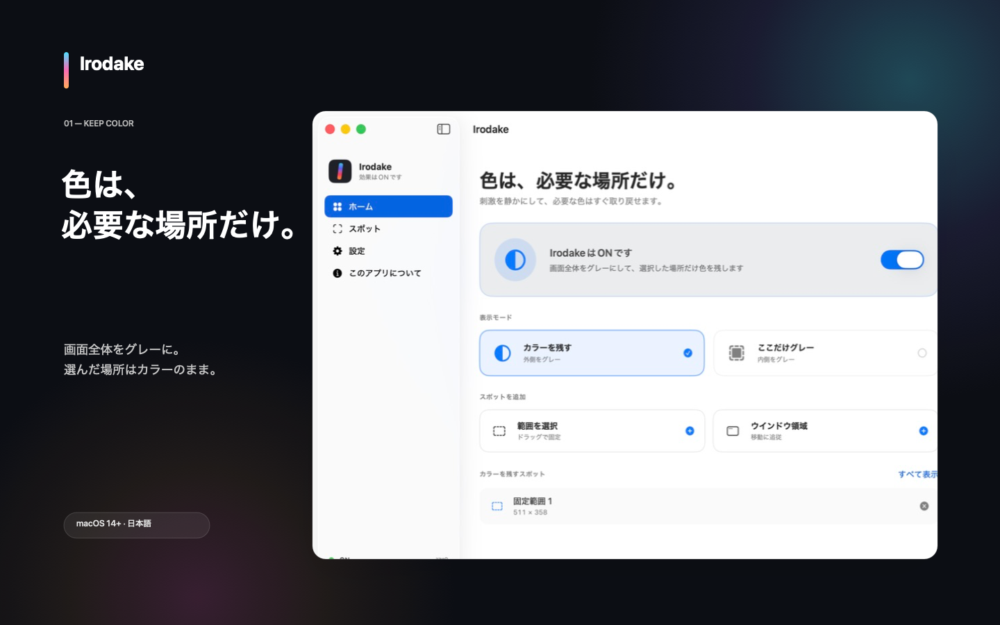

# Irodake — 色は、必要な場所だけ。

Irodakeは、Mac全体をグレースケールにしながら選んだ範囲だけカラーを残したり、その逆に選んだ範囲だけをグレーにしたりできる、ネイティブmacOSアプリです。

通常のアプリウインドウとメニューバーの両方から操作できます。画面はこのMac上でリアルタイム処理され、画像・音声の保存、外部送信、テレメトリ、広告はありません。

[公式サイト](https://irodake.hinoshiba.com/) · [English](https://irodake.hinoshiba.com/en/) · [Privacy](https://irodake.hinoshiba.com/#privacy) · [Support](https://irodake.hinoshiba.com/#support)



## できること

- **カラーを残す** — 画面全体をグレーにし、選択スポットだけ元のカラーで表示
- **ここだけグレー** — 画面全体はカラーのまま、選択スポットだけグレーで表示
- **固定範囲** — 任意の矩形をドラッグして追加
- **ウインドウ領域** — 選択ウインドウの矩形へ移動・リサイズ追従
- **一括ON / OFF** — メニューバーまたは `⌥⌘G`
- **カラーピーク** — `⌥⌘C` を押している間だけ元の全カラーを確認
- **複数ディスプレイ** — ディスプレイごとにScreenCaptureKit streamを構成
- **日本語 / English** — アプリ内で切り替え
- **ログイン時起動** — macOS標準の `SMAppService` を使用

## 必要環境

- macOS 14 Sonoma以降
- Metal対応Mac
- 「画面収録とシステムオーディオ録音」の許可

Accessibility、Input Monitoring、Apple Events、ネットワークの各権限は使いません。音声キャプチャも無効です。

## ビルド

Xcode 26.6 / Swift 6.3で検証しています。runtimeの外部パッケージ依存はありません。`project.yml`を変更する場合のみ[XcodeGen](https://github.com/yonaskolb/XcodeGen)が必要です。

```bash
swift build
swift test
xcodebuild \
  -project Irodake.xcodeproj \
  -scheme Irodake \
  -destination 'platform=macOS' \
  build CODE_SIGNING_ALLOWED=NO
```

`project.yml`がXcode project設定の正本です。Xcode Cloudが常に解決できるよう、生成した`Irodake.xcodeproj`とshared schemeもリポジトリに含めます。構成を変更したら`xcodegen generate`を実行し、両方を同じPRで更新してください。

App Store向けの署名・archive・uploadはローカルで行いません。バージョン更新のPRをmergeした後、`vX.Y.Z`形式のタグをpushするとXcode Cloudがtest・archive・App Store Connectへのuploadを実行します。詳細は[release runbook](docs/RELEASE.md)を参照してください。プライバシー・公開API・依存関係は`./Scripts/audit-source.sh`、Storeメタデータは`./Scripts/audit-store-assets.sh`で検査できます。

## 使い方

1. Irodakeを起動し、オンボーディングを確認します。
2. macOSの画面収録許可を与えます。
3. 「カラーを残す」または「ここだけグレー」を選びます。
4. 固定範囲かウインドウ領域を追加します。
5. トグルをONにします。

ウインドウ領域は対象ウインドウの現在の矩形です。他のウインドウが上に重なると、重なった部分にも同じ表示効果が適用されます。追跡ルールはプライバシーと `CGWindowID` 再利用事故を避けるため、アプリ終了時に破棄されます。

## 仕組みと制約

IrodakeはAppleの公開APIとApp Sandboxの範囲で、ScreenCaptureKitのフレームをCore Image + Metalで変換し、クリック透過overlayへ表示します。詳しくは[Architecture](docs/ARCHITECTURE.md)をご覧ください。

- 表示はリアルタイム再描画のため、1〜2フレーム程度遅れる場合があります。
- DRM / capture-protected contentは黒、静止画、または欠落として表示される場合があります。回避処理は行いません。
- 初期版はSDRです。4K / 5Kの複数画面ではGPU・メモリ帯域・電力を使います。既定は30 fpsです。
- macOS標準のシステムグレースケールがONの場合、Irodakeがカラーを復元することはできません。
- OFF、スリープ、権限取消、キャプチャエラー時はoverlayを先に外すfail-open設計です。

実機確認項目は[Release Test Matrix](docs/TEST_MATRIX.md)にあります。

## プライバシー

Irodakeは画面フレームをGPUで処理しますが、画面画像や音声をファイルへ保存せず、Macの外へ送信しません。ネットワーク通信コードと分析SDKはありません。

正式な日英ポリシーは公式サイト内の[Privacy Policy](https://irodake.hinoshiba.com/#privacy)で公開します。提出用のApp Privacy根拠は[app-store/app-privacy.md](app-store/app-privacy.md)にあります。

## OSSと公式配布

ソースコードは[MIT License](LICENSE)です。利用、改変、再配布、販売ができます。現在のruntime依存はAppleのOS提供frameworkだけで、外部コード・バイナリはありません。通知は[THIRD_PARTY_LICENSES.txt](THIRD_PARTY_LICENSES.txt)にまとめています。

`Irodake` の名称とロゴはコードライセンスとは別です。改変版を公式版と誤認させないため、[Trademark Policy](TRADEMARKS.md)もご確認ください。

Mac App Storeの日英メタデータ、審査メモ、プライバシー回答、スクリーンショットは[app-store](app-store/)にあります。Webサイトの配布物は[http_dist](http_dist/)です。

## 参加・報告

- [Contributing](CONTRIBUTING.md)
- [Security Policy](SECURITY.md)
- [Code of Conduct](CODE_OF_CONDUCT.md)
- [Dependency Policy](docs/DEPENDENCY_POLICY.md)
